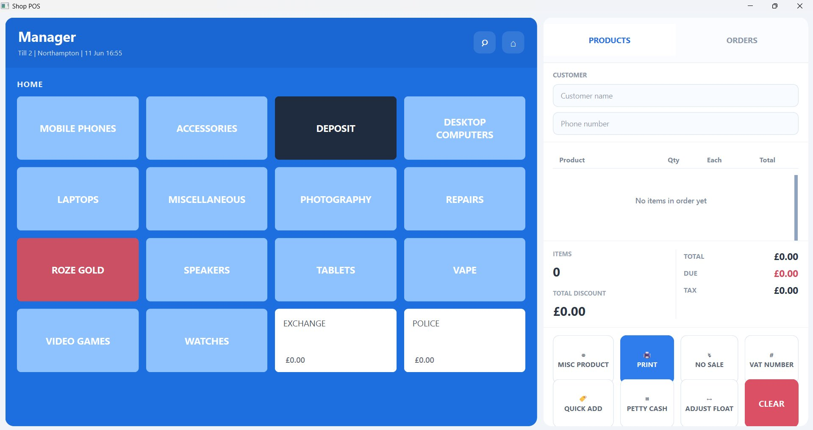
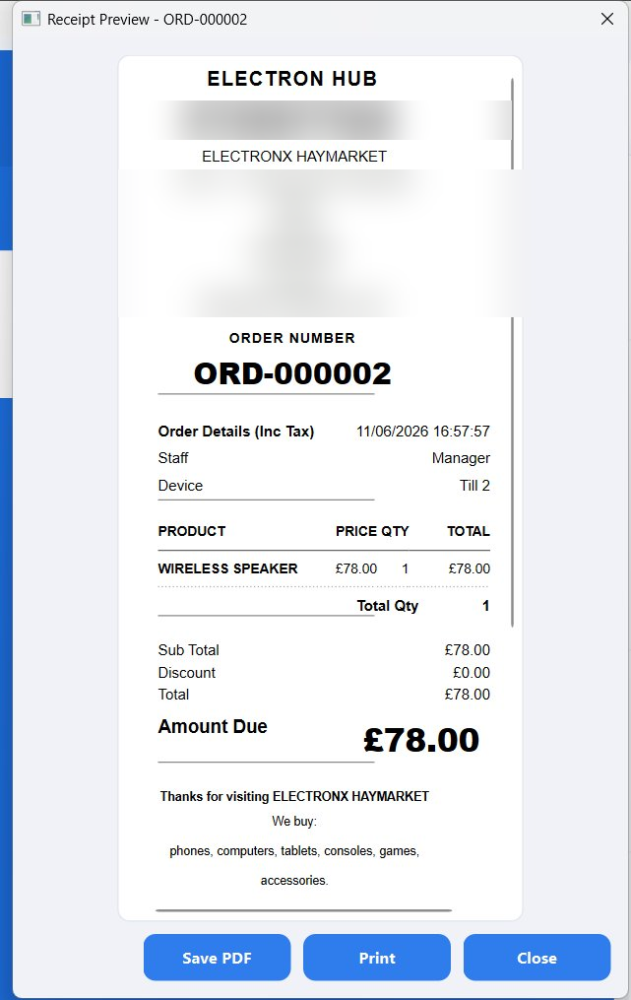
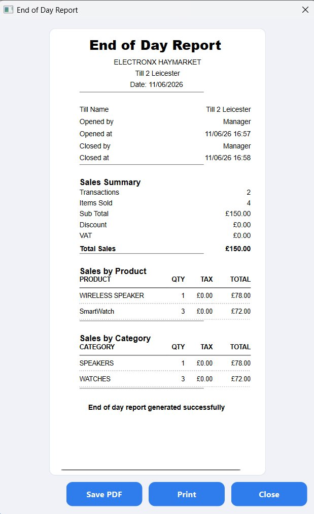

# Shop POS System

A desktop Point of Sale (POS) application built for a real electronics retail business operating multiple branches. It handles the full sales workflow building an order, applying discounts and VAT, taking payment, and printing a receipt and gives staff an end-of-day sales report.

The application is **deployed as a standalone desktop app** and is **configurable per branch**: each shop runs the same software, with only its own name, branch details and product list changed through configuration, rather than maintaining a separate codebase for every location.

Built with Python and PySide6 (Qt), with a local SQLite database.

---
## Screenshots

### Main POS Screen


### Receipt


### End-of-Day Report


---

## Features

- **Order management** — build customer orders from a categorised product menu (phones, laptops, accessories, repairs and more), with quantities, notes and custom prices.
- **Discounts & VAT** — apply per-item or order-level discounts and handle VAT, including VAT-number receipts where required.
- **Receipt printing** — generate and print formatted receipts with the shop's logo and branch details.
- **Order history** — browse, search and reprint past orders.
- **End-of-day report** — summarise the day's sales and totals for reconciliation.
- **Multi-branch ready** — the same app is deployed across several shop locations, configured per branch.

## Tech Stack

- **Language:** Python
- **GUI:** PySide6 (Qt for Python)
- **Database:** SQLite
- **Packaging:** PyInstaller — distributed as a standalone Windows desktop application (no Python install needed)

## Getting Started

```bash
# Install dependencies
pip install PySide6

# Run the app
python main.py
```

The SQLite database is created automatically on first run, so no manual setup is required.

> A pre-built Windows version is available under **[Releases](../../releases)** — download, unzip and run the app directly, with no Python installation needed.

## Project Structure

```
├── main.py            # Application entry point
├── database.py        # SQLite schema and data access
├── models.py          # Data models
├── config.py          # App paths and configuration
├── data/              # Product menu and categories
└── ui/                # All interface screens and dialogs
    ├── main_window.py       # Main POS screen
    ├── receipt_printer.py   # Receipt generation and printing
    ├── orders_dialog.py     # Order history
    ├── end_of_day_report.py # Daily sales report
    └── ...                  # Discount, VAT, price and note dialogs
```
